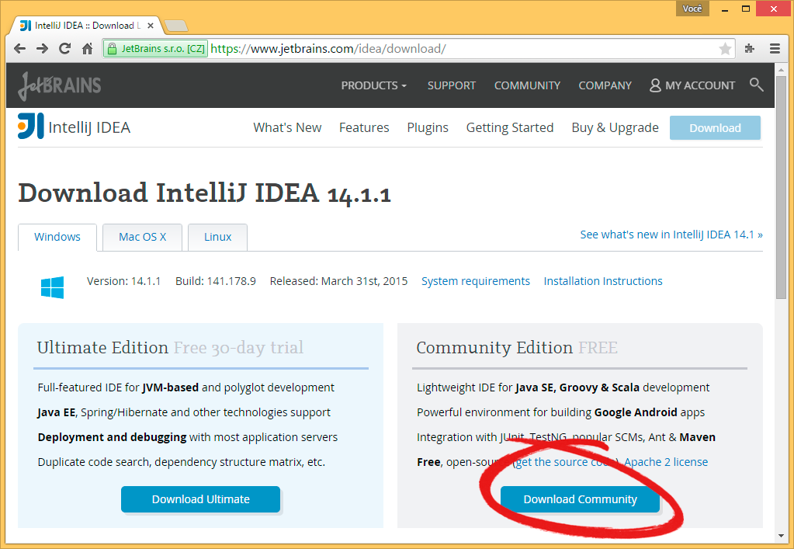

Instalação do IntelliJ IDEA
===========================
Para que você possa criar e executar códigos em Java com maior
praticidade você pode utilizar um *Ambiente de Desenvolvimento
Integrado*, mais conhecido como *IDE* (Integrated Development
Environment).
Neste guia, mostraremos como instalar o *IntelliJ IDEA* e criar um
novo projeto para ser executado.

Download
--------
Para baixar o *IntelliJ IDEA*, acesse
https://www.jetbrains.com/idea/download e clique no botão ``Download
Community``:

Instalação
----------
Execute o arquivo baixado (provavelmente salvo na pasta
``C:\Users\<Seu Nome>\Downloads``) para iniciar a instalação e clique
em ``Next``:

Configuração
''''''''''''
Na janela do local de instalação, é possível alterar onde o *IntelliJ
IDEA* será instalado. Neste guia, adotaremos o caminho padrão. Sendo
assim, clique em ``Next``:

Na janela de opções, por conveniência, aconselhamos que marque ambas.
A opção de associar arquivos .java permite que o IDE seja iniciado
automaticamente quando você abrir tais arquivos. Clique em ``Next``:

.. figure:: idea-4.png
    :align: center

Para finalizar a configuração, você pode escolher o diretório do menu
iniciar em que os atalhos da IDE serão criados. Adotaremos o caminho
padrão. Clique em ``Install``:

.. figure:: idea-5.png
    :align: center

Aguarde para que os arquivos sejam extraídos:

Finalização
'''''''''''
Ao término da instalação a seguinte janela será exibida. Marque a
opção ``Run IntelliJ IDEA Community Edition`` e clique em ``Finish``:

Configuração
------------
Ao iniciar o *IntelliJ IDEA*, você será perguntado se já possui
configurações utilizadas anteriormente. Como é a primeira vez que
você o utiliza, deixe a segunda opção marcada, e clique em ``OK``:

 .. figure:: idea-8.png
    :align: center

Em seguida, opções de configuração serão exibidas. Escolha um tema
que mais lhe agrade, e clique em ``Skip All and Set Defaults`` para
utilizar configurações pré-definidas:

O *IntelliJ IDEA* estará pronto para ser utilizado.

Hello World
-----------
Agora iremos criar um novo projeto para que você execute um código
Java e certifique-se de que tudo está funcionando corretamente.

Ao iniciar o *IntelliJ IDEA*, a janela inicial será exibida. Clique
em ``Create New Project``:

Caso o *JDK* não tenha sido identificado como na seguinte imagem:

Clique em ``New`` e então em ``JDK``:

Procure o local onde o *JDK* foi instalado. Neste guia, utilizaremos
``C:\Program Files\Java\jdk1.8.0_45``. Selecione o diretório e clique
em ``OK`` :

Verifique se o *JDK 1.8* foi detectado e clique em ``Next`` :

Marque a opção ``Create project from template``, selecione o
*template* ``Command Line App`` e clique em ``Next``:

Digite um nome para o projeto e clique em ``Finish``:

Digite a seguinte linha dentro do método **main**:

.. code-block:: java

    System.out.println("Hello World!");

Clique no botão **Run** no canto superior direito da janela e confira
o resultado do seu código no painel inferior:

Se você obteve um resultado igual ao da imagem anterior, você acabou
de compilar e executar o seu primeiro código *Java*!
