Instalação do Java
==================

Download
--------

Para baixar o Java, acesse
https://www.oracle.com/technetwork/java/javase/downloads para ser
redirecionado à última versão disponível. Neste guia, foi usada a
versão **8 Update 45**, a mais recente até o momento. Clique no
botão ``DOWNLOAD`` do JDK:

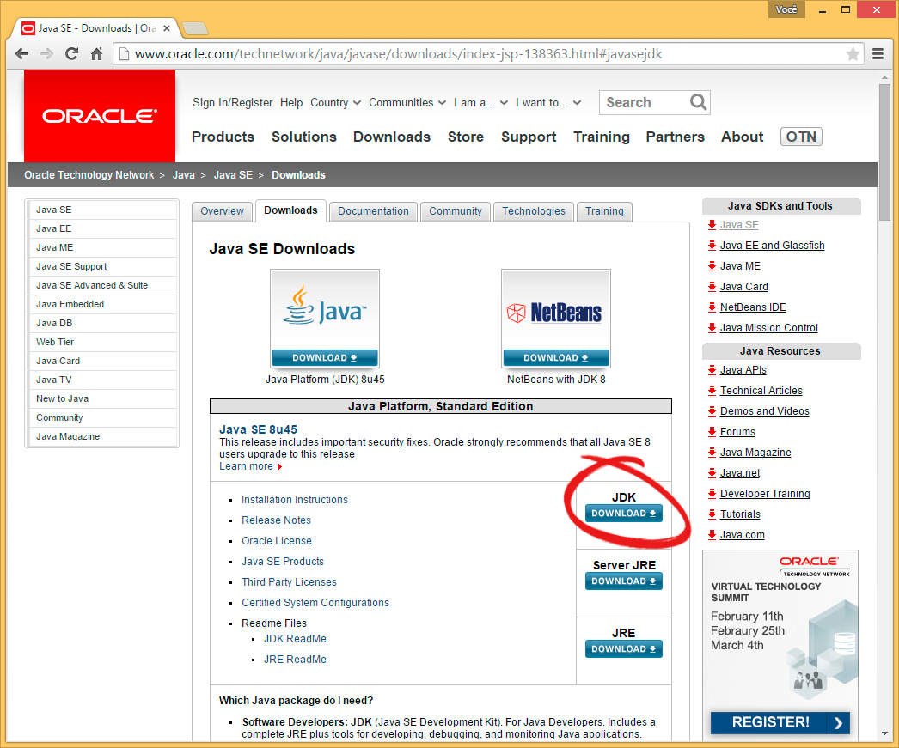

Certifique-se de que você foi redirecionado à pagina de download do
**Java SE Development Kit**, aceite o acordo de licença:

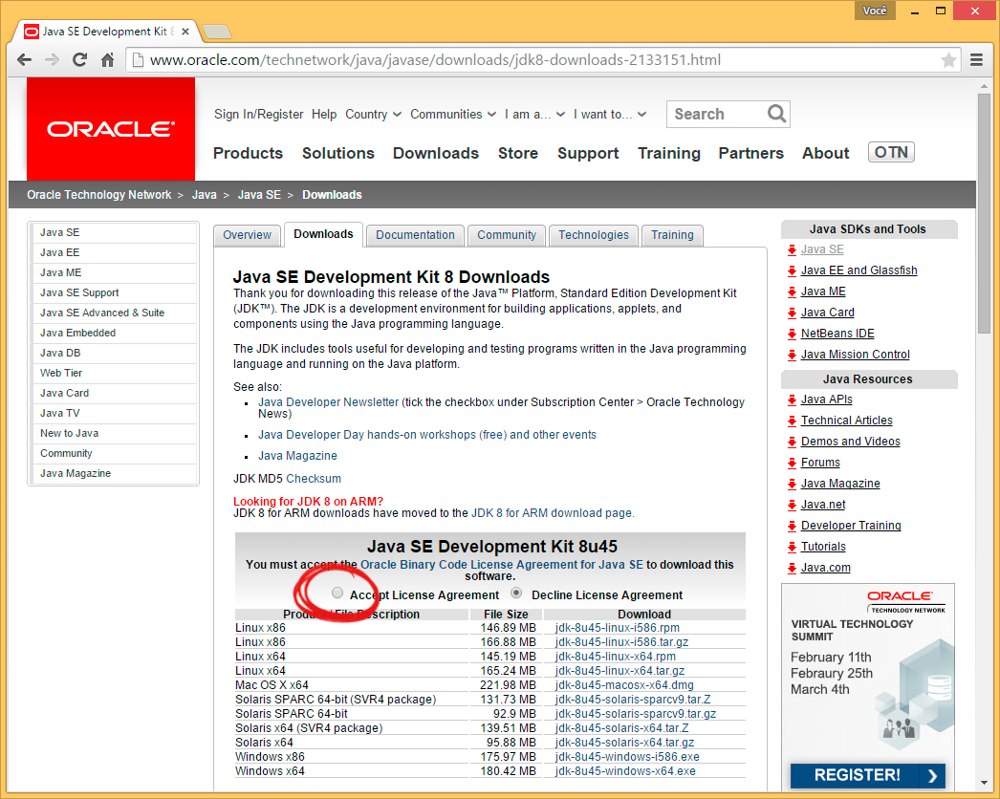

E baixe o arquivo referente à versão do sistema operacional:

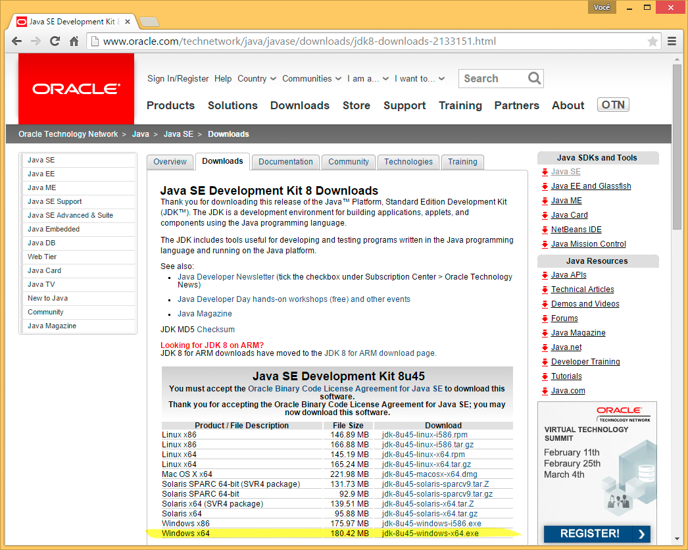

Instalação
----------
Execute o arquivo baixado (provavelmente salvo na pasta
``C:\Users\<Seu Nome>\Downloads``) para iniciar a instalação e clique
em ``Next``:

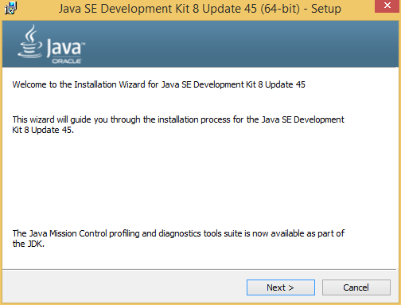

Configuração
''''''''''''
Na janela de configuração do JDK, é possível alterar o quê e onde será
instalado. A mudança do diretório não altera o funcionamento do Java,
porém, alguns artigos sugerem a instalação do JDK em uma pasta raiz
do drive ``C:`` para facilitar sua busca posteriormente.

Neste guia, por razões de padronização com os laboratórios da UTFPR,
adotaremos o caminho padrão. Sendo assim, clique em ``Next``:

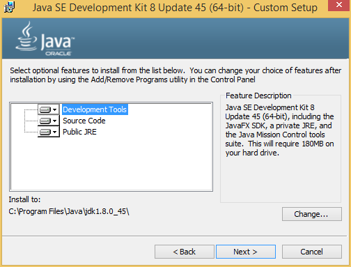

Java Runtime Environment
''''''''''''''''''''''''
Na janela de instalação, enquanto os arquivos são copiados, uma
janela de configuração do Java Runtime Environment (JRE) será
exibida. Basta clicar em ``Próximo``:

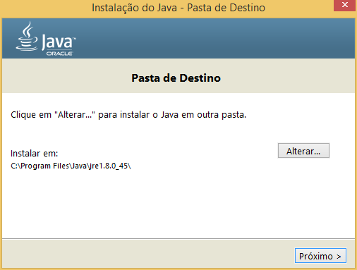

Em seguida, a instalação do JRE e posteriormente do JDK serão
finalizadas. Apenas aguarde até que a barra de progresso seja
preenchida:

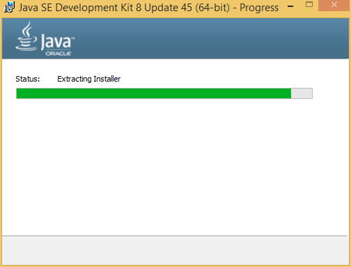

Finalização
'''''''''''
Ao término da instalação a seguinte janela será exibida. Clique em
``Close``:

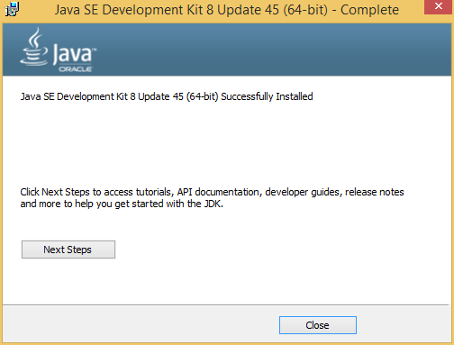

Variáveis de Ambiente
---------------------
Após o processo de instalação do JDK, deve-se adicioná-lo ao *path*
do sistema. Para isso, deve-se abrir as propriedades do sistema. No
Windows 8, basta pressionar ``Tecla Windows + X`` e clicar em
``Sistema``:

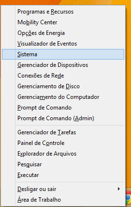

É possível também clicar com o botão direito em ``Meu computador`` e
em ``Propriedades`` caso esteja usando uma versão anterior do
Windows.

Na janela de propriedades do sistema, clique em ``Configurações
avançadas do sistema``:

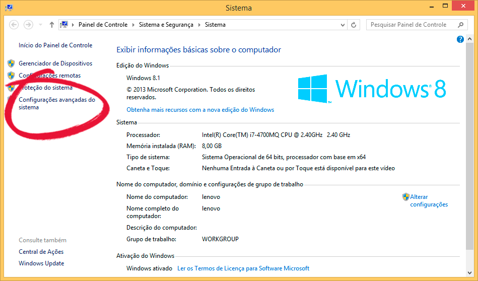

Em seguida, clique na aba ``Avançado`` e abra as ``Variáveis de
ambiente``:

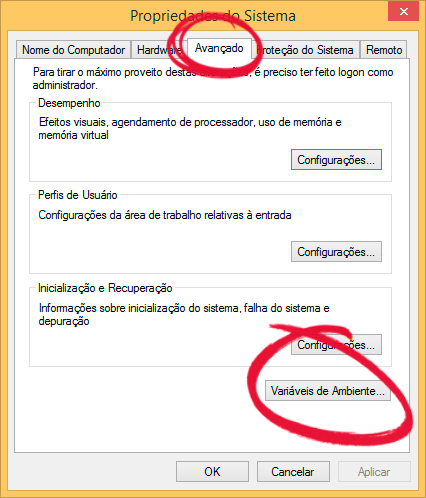

Na janela de variáveis de ambiente, encontram-se duas seções:
``Variáveis de usuário`` e ``Variáveis do sistema``. Quando a
primeira é configurada, as modificações só ocorrerão para o usuário
ativo, enquanto para a segunda, irão ocorrer para o sistema e
consequentemente, para todos os usuários.

Neste guia, somente as variáveis de usuário serão configuradas, mas
o processo para configurar as variáveis do sistema é o mesmo.
**Lembre-se que para tal, é preciso estar logado com um usuário
administrador sistema.**

Deve-se definir três variáveis de ambiente: ``JAVA_HOME``,
``CLASSPATH`` e ``PATH``. Para cada uma das variáveis, com o auxílio
das próximas seções, realize o seguinte processo:

- Clique em ``Novo`` na seção superior (de usuário) das variáveis de
  ambiente

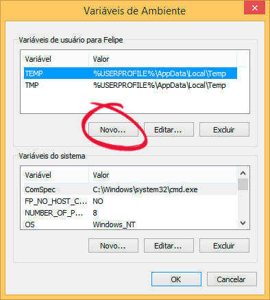

- Digite a variável no primeiro campo

- Digite o valor no segundo campo

- Clique em ``OK``

JAVA_HOME
'''''''''
Aponta para o diretório de instalação do JDK, para que programas
que o utilizam possam encontrá-lo.

Valor a ser inserido: ``C:\Program Files\Java\jdk1.8.0_45``.

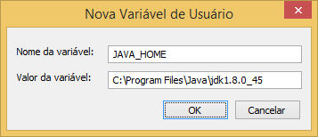

CLASSPATH
'''''''''
Aponta para o diretório que contem classes para que o Java possa
carregá-las.

Valor a ser inserido: ``.;JAVA_HOME``.

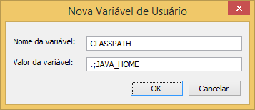

PATH
''''
Aponta para arquivos executáveis para que o sistema possa executar
programas independentemente do local que eles tenham sido chamados.

Valor a ser inserido: ``C:\Program Files\Java\jdk1.8.0_45\bin``.

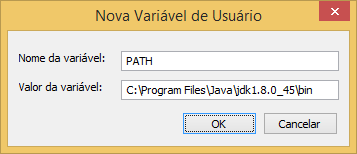

A variável ``PATH`` é importante pois tanto o **javac** quanto o
**java** se encontram no diretório ``bin``. Portanto, eles são
adicionados ao *path* para **compilar** e **executar** programas Java
diretamente de seus respectivos diretórios.

Verificação
-----------

Após configurar todas as variáveis, verifique se o sistema consegue
encontrar o compilador Java. Para isso, pressione
``Tecla Windows + R``, digite ``cmd`` e clique em ``OK``:

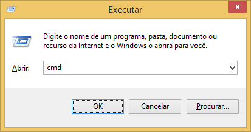

Finalmente, digite ``java -version`` no prompt de comando e
pressione ``Enter``. As seguintes informações deverão ser exibidas:

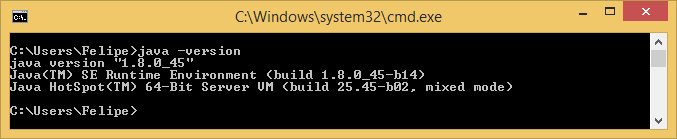

Caso o resultado não seja o mesmo, a instalação não foi bem sucedida.
Verifique se as variáveis de ambiente foram configuradas corretamente
e certifique-se de que o JDK realmente foi instalado no diretório
escolhido no momento da instalação.
