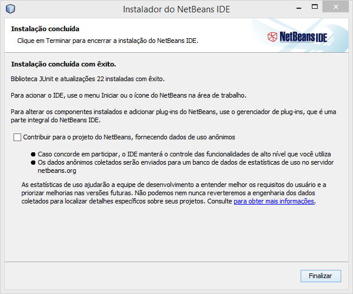

Instalação do NetBeans
======================
Para que você possa criar e executar códigos em Java com maior
praticidade você pode utilizar um *Ambiente de Desenvolvimento
Integrado*, mais conhecido como *IDE* (Integrated Development
Environment).
Neste guia, mostraremos como instalar o *NetBeans* e criar um novo
projeto para ser executado.

Download
--------
Para baixar o *NetBeans*, acesse https://netbeans.org/downloads e
clique no botão ``Download`` da versão para *Java SE*:

Instalação
----------
Execute o arquivo baixado (provavelmente salvo na pasta
``C:\Users\<Seu Nome>\Downloads``) para iniciar a instalação e clique
em ``Próximo``:

Licença
'''''''
Na janela de licença, aceite os termos e clique em ``Próximo``:

JUnit
'''''
Você provavelmente irá utilizar o framework *JUnit* para testar seus
projetos futuramente. Aconselhamos que aceite os termos e instale-o
também:

.. figure:: netbeans-4.png
    :align: center

Configuração
''''''''''''
Na janela do local de instalação, é possível alterar onde o
*NetBeans* será instalado. Neste guia, adotaremos o caminho padrão.
Sendo assim, clique em ``Próximo``:

Resumo
''''''
A janela de resumo será exibida antes da instalação. Nela é possível
marcar para que atualizações sejam baixadas automaticamente. Por
conveniência, aconselhamos que marque esta opção. Clique em
``Instalar``:

Aguarde para que os arquivos sejam extraídos:

Finalização
'''''''''''
Ao término da instalação a seguinte janela será exibida. O *NetBeans*
disponibiliza uma opção de contribuir para seu desenvolvimento ao
fornecer dados de uso anônimos automaticamente. Você pode desmarcar a
opção caso não queira enviá-los. Clique em ``Finalizar``:

O *NetBeans* estará pronto para ser utilizado.

Hello World
-----------
Agora iremos criar um novo projeto para que você execute um código
Java e certifique-se de que tudo está funcionando corretamente.

Ao iniciar o *NetBeans*, a janela principal será exibida. Clique
no ícone de ``Novo Projeto`` no canto superior esquerdo:

Escolha a categoria ``Java``, o projeto ``Aplicação Java`` e clique
em ``Próximo``:

Digite um nome para o projeto, certifique-se de que a opção ``Criar
Classe Principal`` está marcada e clique em ``Finalizar``:

Digite a seguinte linha dentro do método **main**:

.. code-block:: java

    System.out.println("Hello World!");

Clique no botão **Executar** no canto superior da janela e confira o
resultado do seu código no painel inferior:

Se você obteve um resultado igual ao da imagem anterior, você acabou
de compilar e executar o seu primeiro código *Java*!
